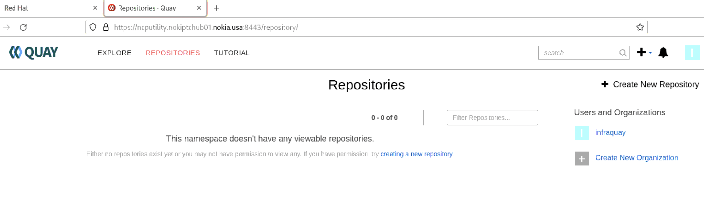
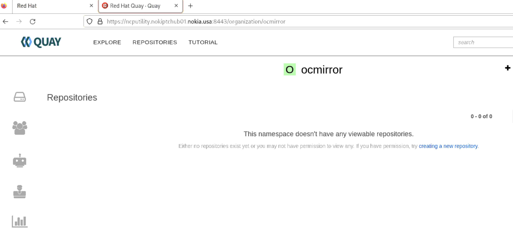

## Bastion host configured to host the quay for disconnected mirror

#### Installing the necessary packages for the Hub Cluster deployment


1. Login to the node via SSH, using the user created with Administrator privileges. Root user is not needed.
    For higher security, key based authentication can be used for SSH and the password authentication may
    be disabled.
2. Verify the hostname of the node using `hostname -f` command
3. Copy the `rhel_rhcos.tar.gz` to the node. Uncompress it using the command tar `rhel_rhcos.tar.gz.-zxvf`
4. Create a directory to mount the ISO file
```
sudo cp rhel-9.4-x86_64-dvd.iso /mnt
sudo mkdir -p /mnt/rhel9.4
echo '/mnt/rhel-9.4-x86_64-dvd.iso /mnt/rhel9.4/ iso9660 loop 0 0' | sudo
tee -a /etc/fstab
sudo mount -a
```
5. Create a local repo from the ISO which is mounted:
```
cat << 'EOF' | sudo tee -a /etc/yum.repos.d/rhel9.4dvd.repo
[BaseOS]
name=BaseOS Packages Red Hat Enterprise Linux 9
metadata_expire=-1
gpgcheck=1
enabled=1
baseurl=file:///mnt/rhel9.4/BaseOS/
gpgkey=file:///etc/pki/rpm-gpg/RPM-GPG-KEY-redhat-release
[AppStream]
name=AppStream Packages Red Hat Enterprise Linux 9
metadata_expire=-1
gpgcheck=1
enabled=1
baseurl=file:///mnt/rhel9.4/AppStream/
gpgkey=file:///etc/pki/rpm-gpg/RPM-GPG-KEY-redhat-release
EOF
```
6. Install the necessary packages:

```
[root@ncputility ~]# sudo dnf clean all
Updating Subscription Management repositories.
Unable to read consumer identity

This system is not registered with an entitlement server. You can use "rhc" or "subscription-manager" to register.

13 files removed
[root@ncputility ~]# sudo dnf repolist enabled
Updating Subscription Management repositories.
Unable to read consumer identity

This system is not registered with an entitlement server. You can use "rhc" or "subscription-manager" to register.

repo id                                                                     repo name
AppStream                                                                   AppStream Packages Red Hat Enterprise Linux 9
BaseOS                                                                      BaseOS Packages Red Hat Enterprise Linux 9
[root@ncputility ~]# sudo dnf install wget httpd mkpasswd nmstate podman tcpdump rsync tmux bind-utils chrony net-tools unzip bash-completion
Updating Subscription Management repositories.
Unable to read consumer identity

This system is not registered with an entitlement server. You can use "rhc" or "subscription-manager" to register.

BaseOS Packages Red Hat Enterprise Linux 9                                                                                                                  136 MB/s | 2.1 MB     00:00    
AppStream Packages Red Hat Enterprise Linux 9                                                                                                               208 MB/s | 7.0 MB     00:00    
Package wget-1.21.1-7.el9.x86_64 is already installed.
Package podman-2:4.9.4-0.1.el9.x86_64 is already installed.
Package tcpdump-14:4.99.0-9.el9.x86_64 is already installed.
Package rsync-3.2.3-19.el9.x86_64 is already installed.
Package bind-utils-32:9.16.23-15.el9.x86_64 is already installed.
Package chrony-4.5-1.el9.x86_64 is already installed.
Package net-tools-2.0-0.62.20160912git.el9.x86_64 is already installed.
Package unzip-6.0-56.el9.x86_64 is already installed.
Package bash-completion-1:2.11-5.el9.noarch is already installed.
Dependencies resolved.
============================================================================================================================================================================================
 Package                                            Architecture                           Version                                          Repository                                 Size
============================================================================================================================================================================================
Installing:
 httpd                                              x86_64                                 2.4.57-8.el9                                     
 ** output **

Installed:
  apr-1.7.0-12.el9_3.x86_64         apr-util-1.6.1-23.el9.x86_64            apr-util-bdb-1.6.1-23.el9.x86_64        apr-util-openssl-1.6.1-23.el9.x86_64    httpd-2.4.57-8.el9.x86_64       
  httpd-core-2.4.57-8.el9.x86_64    httpd-filesystem-2.4.57-8.el9.noarch    httpd-tools-2.4.57-8.el9.x86_64         mkpasswd-5.5.9-4.el9.x86_64             mod_http2-2.0.26-1.el9.x86_64   
  mod_lua-2.4.57-8.el9.x86_64       nmstate-2.2.25-1.el9.x86_64             redhat-logos-httpd-90.4-2.el9.noarch    tmux-3.2a-5.el9.x86_64                  whois-nls-5.5.9-4.el9.noarch    

Complete!
[root@ncputility ~]# 
```

7. Start and enable HTTP server:

```
[root@ncputility ~]# sudo systemctl start httpd
[root@ncputility ~]# sudo systemctl enable httpd
Created symlink /etc/systemd/system/multi-user.target.wants/httpd.service → /usr/lib/systemd/system/httpd.service.
[root@ncputility ~]# 
```

8. Allow ports 80 for the webserver (later it will be used by the Hub Cluster for fetching CoreOS) and 8443 which will be the mirror-registry’s port.

```
[root@ncputility ~]# sudo firewall-cmd --zone=public --add-port=80/tcp --permanent
success
[root@ncputility ~]# sudo firewall-cmd --zone=public --add-port=8443/tcp --permanent
success
[root@ncputility ~]# sudo firewall-cmd –reload
usage: 'firewall-cmd --help' for usage information or see firewall-cmd(1) man page
firewall-cmd: error: unrecognized arguments: –reload
[root@ncputility ~]# sudo firewall-cmd --reload
success
[root@ncputility ~]# sudo firewall-cmd --list-all
public (active)
  target: default
  icmp-block-inversion: no
  interfaces: 140
  sources: 
  services: cockpit dhcpv6-client ssh vnc-server
  ports: 5902/tcp 53/tcp 53/udp 80/tcp 8443/tcp
  protocols: 
  forward: yes
  masquerade: no
  forward-ports: 
  source-ports: 
  icmp-blocks: 
  rich rules: 
[root@ncputility ~]# 
```

9. Set NTP servers, Udate the correct ntp ip on the configuration file `/etc/chrony.conf`

```
[root@ncputility ~]# sudo vi /etc/chrony.conf^C
[root@ncputility ~]# chronyc sources
MS Name/IP address         Stratum Poll Reach LastRx Last sample               
===============================================================================
^* 135.112.203.53                2   7   377    43   -221ns[  +11us] +/-   22ms
[root@ncputility ~]# timedatectl 
               Local time: Wed 2025-03-26 17:19:06 EDT
           Universal time: Wed 2025-03-26 21:19:06 UTC
                 RTC time: Wed 2025-03-26 21:19:06
                Time zone: America/New_York (EDT, -0400)
System clock synchronized: yes
              NTP service: active
          RTC in local TZ: no
[root@ncputility ~]# 
```

10. Modify the chrony configuration according to the available NTP servers:

```
cat /etc/chrony.conf | grep -v '#'
server 10.171.8.4 iburst
server 10.171.8.5 iburst
sourcedir /run/chrony-dhcp
driftfile /var/lib/chrony/drift
makestep 1.0 3
rtcsync
keyfile /etc/chrony.keys
ntsdumpdir /var/lib/chrony
leapsectz right/UTC
logdir /var/log/chrony
```

11. Enable and restart chronyd

```
sudo systemctl enable chronyd
sudo systemctl restart chronyd
```

12. Verify NTP sources:

```
[root@ncputility ~]# sudo vi /etc/chrony.conf^C
[root@ncputility ~]# chronyc sources
MS Name/IP address         Stratum Poll Reach LastRx Last sample               
===============================================================================
^* 135.112.203.53                2   7   377    43   -221ns[  +11us] +/-   22ms
[root@ncputility ~]#

```

#### Installing the mirror-registry on the infrastructure manager node

1. Uncompress the mirror-registry, which can be found in the previously uncompressed ncp_tools.tar.gz in compressed format. This will be a local registry from where the Hub Cluster can fetch its images.

```
[root@ncputility ncp]# tar -xvf ncp_tools.tar.gz
butane-amd64
butane-amd64.sha256
butane-windows-amd64.exe
butane-windows-amd64.exe.sha256
helm-linux-amd64
helm-linux-amd64.sha256
helm-windows-amd64.exe
helm-windows-amd64.exe.sha256
kustomize_v5.4.3_linux_amd64.tar.gz
kustomize_v5.4.3_linux_amd64.tar.gz.sha256
mirror-registry.tar.gz
mirror-registry.tar.gz.sha256
oc-mirror.tar.gz
oc-mirror.tar.gz.sha256
openshift-client-linux.tar.gz
openshift-client-linux.tar.gz.sha256
openshift-client-windows.zip
openshift-client-windows.zip.sha256
openshift-install-linux.tar.gz
openshift-install-linux.tar.gz.sha256
opm-linux.tar.gz
opm-linux.tar.gz.sha256
opm-windows.tar.gz
opm-windows.tar.gz.sha256
s3cmd-2.4.0.tar.gz
s3cmd-2.4.0.tar.gz.sha256
[root@ncputility ncp]#
 ```

2. Create a folder for the quay root:

```
[root@ncputility ~]#  mkdir -p /opt/quayroot
[root@ncputility ~]# 
```
The owner shall be the Linux user who is installing it. For example:
sudo chown <user:user> /opt/quayroot/

    a. extract the mirror-registry file.

    ```
    [root@ncputility ncp]# tar -xvf mirror-registry.tar.gz
    image-archive.tar
    execution-environment.tar
    mirror-registry
    [root@ncputility ncp]# 

    ```

2.1 Quay installation

```
[root@ncputility ncp]# ./mirror-registry install --initUser infraquay --initPassword Nokia12234 --quayRoot /opt/quayroot

   __   __
  /  \ /  \     ______   _    _     __   __   __
 / /\ / /\ \   /  __  \ | |  | |   /  \  \ \ / /
/ /  / /  \ \  | |  | | | |  | |  / /\ \  \   /
\ \  \ \  / /  | |__| | | |__| | / ____ \  | |
 \ \/ \ \/ /   \_  ___/  \____/ /_/    \_\ |_|
  \__/ \__/      \ \__
                  \___\ by Red Hat
 Build, Store, and Distribute your Containers
	
INFO[2025-03-26 17:25:38] Install has begun                            
INFO[2025-03-26 17:25:38] Found execution environment at /root/ncp/execution-environment.tar 
INFO[2025-03-26 17:25:38] Loading execution environment from execution-environment.tar 
INFO[2025-03-26 17:25:49] Detected an installation to localhost        
INFO[2025-03-26 17:25:49] Did not find SSH key in default location. Attempting to set up SSH keys. 
INFO[2025-03-26 17:25:49] Generating SSH Key                           
INFO[2025-03-26 17:25:50] Generated SSH Key at /root/.ssh/quay_installer 
INFO[2025-03-26 17:25:50] Adding key to ~/.ssh/authorized_keys         
INFO[2025-03-26 17:25:50] Successfully set up SSH keys                 
INFO[2025-03-26 17:25:50] Attempting to set SELinux rules on /root/.ssh/quay_installer 
INFO[2025-03-26 17:25:50] Found image archive at /root/ncp/image-archive.tar 
INFO[2025-03-26 17:25:50] Detected an installation to localhost        
INFO[2025-03-26 17:25:50] Unpacking image archive from /root/ncp/image-archive.tar 
INFO[2025-03-26 17:25:52] Loading pause image archive from pause.tar   
INFO[2025-03-26 17:25:58] Loading redis image archive from redis.tar   
INFO[2025-03-26 17:26:05] Loading postgres image archive from postgres.tar 
INFO[2025-03-26 17:26:17] Loading Quay image archive from quay.tar     
INFO[2025-03-26 17:26:45] Attempting to set SELinux rules on image archive 
INFO[2025-03-26 17:26:45] Running install playbook. This may take some time. To see playbook output run the installer with -v (verbose) flag. 
INFO[2025-03-26 17:26:45] Detected an installation to localhost        

PLAY [Install Mirror Appliance] ************************************************************************************************************************************************************

TASK [Gathering Facts] *********************************************************************************************************************************************************************
ok: [root@ncputility.nokiptchub01.nokia.usa]

TASK [mirror_appliance : Expand variables] *************************************************************************************************************************************************
included: /runner/project/roles/mirror_appliance/tasks/expand-vars.yaml for root@ncputility.nokiptchub01.nokia.usa

TASK [mirror_appliance : Expand pg_storage] ************************************************************************************************************************************************
changed: [root@ncputility.nokiptchub01.nokia.usa]

TASK [mirror_appliance : Expand quay_root] *************************************************************************************************************************************************
changed: [root@ncputility.nokiptchub01.nokia.usa]

TASK [mirror_appliance : Expand quay_storage] **********************************************************************************************************************************************
changed: [root@ncputility.nokiptchub01.nokia.usa]

TASK [mirror_appliance : Set expanded variables] *******************************************************************************************************************************************
ok: [root@ncputility.nokiptchub01.nokia.usa]

TASK [mirror_appliance : Install Dependencies] *********************************************************************************************************************************************
included: /runner/project/roles/mirror_appliance/tasks/install-deps.yaml for root@ncputility.nokiptchub01.nokia.usa

TASK [mirror_appliance : Create user service directory] ************************************************************************************************************************************
ok: [root@ncputility.nokiptchub01.nokia.usa]

TASK [mirror_appliance : Set SELinux Rules] ************************************************************************************************************************************************
included: /runner/project/roles/mirror_appliance/tasks/set-selinux-rules.yaml for root@ncputility.nokiptchub01.nokia.usa

TASK [mirror_appliance : Set container_manage_cgroup flag on and keep it persistent across reboots] ****************************************************************************************
skipping: [root@ncputility.nokiptchub01.nokia.usa]

TASK [mirror_appliance : Install Quay Pod Service] *****************************************************************************************************************************************
included: /runner/project/roles/mirror_appliance/tasks/install-pod-service.yaml for root@ncputility.nokiptchub01.nokia.usa

TASK [mirror_appliance : Copy Quay Pod systemd service file] *******************************************************************************************************************************
changed: [root@ncputility.nokiptchub01.nokia.usa]

TASK [mirror_appliance : Check if pod pause image is loaded] *******************************************************************************************************************************
changed: [root@ncputility.nokiptchub01.nokia.usa]

TASK [mirror_appliance : Pull Infra image] *************************************************************************************************************************************************
skipping: [root@ncputility.nokiptchub01.nokia.usa]

TASK [mirror_appliance : Start Quay Pod service] *******************************************************************************************************************************************
changed: [root@ncputility.nokiptchub01.nokia.usa]

TASK [mirror_appliance : Autodetect Image Archive] *****************************************************************************************************************************************
included: /runner/project/roles/mirror_appliance/tasks/autodetect-image-archive.yaml for root@ncputility.nokiptchub01.nokia.usa

TASK [mirror_appliance : Checking for Image Archive] ***************************************************************************************************************************************
ok: [root@ncputility.nokiptchub01.nokia.usa -> localhost]

TASK [mirror_appliance : Create install directory for image-archive.tar dest] **************************************************************************************************************
ok: [root@ncputility.nokiptchub01.nokia.usa]

TASK [mirror_appliance : Copy Images if /runner/image-archive.tar exists] ******************************************************************************************************************
skipping: [root@ncputility.nokiptchub01.nokia.usa]

TASK [mirror_appliance : Unpack Images if /runner/image-archive.tar exists] ****************************************************************************************************************
skipping: [root@ncputility.nokiptchub01.nokia.usa]

TASK [mirror_appliance : Loading Redis if redis.tar exists] ********************************************************************************************************************************
skipping: [root@ncputility.nokiptchub01.nokia.usa]

TASK [mirror_appliance : Loading Quay if quay.tar exists] **********************************************************************************************************************************
skipping: [root@ncputility.nokiptchub01.nokia.usa]

TASK [mirror_appliance : Loading Postgres if postgres.tar exists] **************************************************************************************************************************
skipping: [root@ncputility.nokiptchub01.nokia.usa]

TASK [mirror_appliance : Install Postgres Service] *****************************************************************************************************************************************
included: /runner/project/roles/mirror_appliance/tasks/install-postgres-service.yaml for root@ncputility.nokiptchub01.nokia.usa

TASK [mirror_appliance : Create necessary directory for Postgres persistent data] **********************************************************************************************************
skipping: [root@ncputility.nokiptchub01.nokia.usa]

TASK [mirror_appliance : Set permissions on local storage directory] ***********************************************************************************************************************
skipping: [root@ncputility.nokiptchub01.nokia.usa]

TASK [mirror_appliance : Copy Postgres systemd service file] *******************************************************************************************************************************
changed: [root@ncputility.nokiptchub01.nokia.usa]

TASK [mirror_appliance : Check if Postgres image is loaded] ********************************************************************************************************************************
changed: [root@ncputility.nokiptchub01.nokia.usa]

TASK [mirror_appliance : Pull Postgres image] **********************************************************************************************************************************************
skipping: [root@ncputility.nokiptchub01.nokia.usa]

TASK [mirror_appliance : Create Postgres Storage named volume] *****************************************************************************************************************************
changed: [root@ncputility.nokiptchub01.nokia.usa]

TASK [mirror_appliance : Start Postgres service] *******************************************************************************************************************************************
changed: [root@ncputility.nokiptchub01.nokia.usa]

TASK [mirror_appliance : Wait for pg_trgm to be installed] *********************************************************************************************************************************
FAILED - RETRYING: [root@ncputility.nokiptchub01.nokia.usa]: Wait for pg_trgm to be installed (20 retries left).
changed: [root@ncputility.nokiptchub01.nokia.usa]

TASK [mirror_appliance : Install Redis Service] ********************************************************************************************************************************************
included: /runner/project/roles/mirror_appliance/tasks/install-redis-service.yaml for root@ncputility.nokiptchub01.nokia.usa

TASK [mirror_appliance : Copy Redis systemd service file] **********************************************************************************************************************************
changed: [root@ncputility.nokiptchub01.nokia.usa]

TASK [mirror_appliance : Check if Redis image is loaded] ***********************************************************************************************************************************
changed: [root@ncputility.nokiptchub01.nokia.usa]

TASK [mirror_appliance : Pull Redis image] *************************************************************************************************************************************************
skipping: [root@ncputility.nokiptchub01.nokia.usa]

TASK [mirror_appliance : Start Redis service] **********************************************************************************************************************************************
changed: [root@ncputility.nokiptchub01.nokia.usa]

TASK [mirror_appliance : Install Quay Service] *********************************************************************************************************************************************
included: /runner/project/roles/mirror_appliance/tasks/install-quay-service.yaml for root@ncputility.nokiptchub01.nokia.usa

TASK [mirror_appliance : Create necessary directory for Quay local storage] ****************************************************************************************************************
skipping: [root@ncputility.nokiptchub01.nokia.usa]

TASK [mirror_appliance : Set permissions on local storage directory] ***********************************************************************************************************************
skipping: [root@ncputility.nokiptchub01.nokia.usa]

TASK [mirror_appliance : Create necessary directory for Quay config bundle] ****************************************************************************************************************
changed: [root@ncputility.nokiptchub01.nokia.usa]

TASK [mirror_appliance : Copy Quay config.yaml file] ***************************************************************************************************************************************
changed: [root@ncputility.nokiptchub01.nokia.usa]

TASK [mirror_appliance : Check if SSL Cert exists] *****************************************************************************************************************************************
ok: [root@ncputility.nokiptchub01.nokia.usa -> localhost]

TASK [mirror_appliance : Check if SSL Key exists] ******************************************************************************************************************************************
ok: [root@ncputility.nokiptchub01.nokia.usa -> localhost]

TASK [mirror_appliance : Create necessary directory for Quay rootCA files] *****************************************************************************************************************
changed: [root@ncputility.nokiptchub01.nokia.usa]

TASK [mirror_appliance : Create OpenSSL Config] ********************************************************************************************************************************************
changed: [root@ncputility.nokiptchub01.nokia.usa]

TASK [mirror_appliance : Create root CA key] ***********************************************************************************************************************************************
changed: [root@ncputility.nokiptchub01.nokia.usa]

TASK [mirror_appliance : Create root CA pem] ***********************************************************************************************************************************************
changed: [root@ncputility.nokiptchub01.nokia.usa]

TASK [mirror_appliance : Create ssl key] ***************************************************************************************************************************************************
changed: [root@ncputility.nokiptchub01.nokia.usa]

TASK [mirror_appliance : Create CSR] *******************************************************************************************************************************************************
changed: [root@ncputility.nokiptchub01.nokia.usa]

TASK [mirror_appliance : Create self-signed cert] ******************************************************************************************************************************************
changed: [root@ncputility.nokiptchub01.nokia.usa]

TASK [mirror_appliance : Create chain cert] ************************************************************************************************************************************************
changed: [root@ncputility.nokiptchub01.nokia.usa]

TASK [mirror_appliance : Replace ssl cert with chain cert] *********************************************************************************************************************************
changed: [root@ncputility.nokiptchub01.nokia.usa]

TASK [mirror_appliance : Copy SSL certificate] *********************************************************************************************************************************************
skipping: [root@ncputility.nokiptchub01.nokia.usa]

TASK [mirror_appliance : Copy SSL key] *****************************************************************************************************************************************************
skipping: [root@ncputility.nokiptchub01.nokia.usa]

TASK [mirror_appliance : Set permissions for key] ******************************************************************************************************************************************
changed: [root@ncputility.nokiptchub01.nokia.usa]

TASK [mirror_appliance : Set permissions for cert] *****************************************************************************************************************************************
ok: [root@ncputility.nokiptchub01.nokia.usa]

TASK [mirror_appliance : Copy Quay systemd service file] ***********************************************************************************************************************************
changed: [root@ncputility.nokiptchub01.nokia.usa]

TASK [mirror_appliance : Check if Quay image is loaded] ************************************************************************************************************************************
changed: [root@ncputility.nokiptchub01.nokia.usa]

TASK [mirror_appliance : Pull Quay image] **************************************************************************************************************************************************
skipping: [root@ncputility.nokiptchub01.nokia.usa]

TASK [mirror_appliance : Create Quay Storage named volume] *********************************************************************************************************************************
changed: [root@ncputility.nokiptchub01.nokia.usa]

TASK [mirror_appliance : Start Quay service] ***********************************************************************************************************************************************
changed: [root@ncputility.nokiptchub01.nokia.usa]

TASK [mirror_appliance : Wait for Quay] ****************************************************************************************************************************************************
included: /runner/project/roles/mirror_appliance/tasks/wait-for-quay.yaml for root@ncputility.nokiptchub01.nokia.usa

TASK [mirror_appliance : Waiting up to 3 minutes for Quay to become alive at https://ncputility.nokiptchub01.nokia.usa:8443/health/instance] ***********************************************
FAILED - RETRYING: [root@ncputility.nokiptchub01.nokia.usa]: Waiting up to 3 minutes for Quay to become alive at https://ncputility.nokiptchub01.nokia.usa:8443/health/instance (10 retries left).
ok: [root@ncputility.nokiptchub01.nokia.usa]

TASK [mirror_appliance : Create init user] *************************************************************************************************************************************************
included: /runner/project/roles/mirror_appliance/tasks/create-init-user.yaml for root@ncputility.nokiptchub01.nokia.usa

TASK [mirror_appliance : Creating init user at endpoint https://ncputility.nokiptchub01.nokia.usa:8443/api/v1/user/initialize] *************************************************************
ok: [root@ncputility.nokiptchub01.nokia.usa]

TASK [mirror_appliance : Enable lingering for systemd user processes] **********************************************************************************************************************
skipping: [root@ncputility.nokiptchub01.nokia.usa]

PLAY RECAP *********************************************************************************************************************************************************************************
root@ncputility.nokiptchub01.nokia.usa : ok=50   changed=30   unreachable=0    failed=0    skipped=17   rescued=0    ignored=0   

INFO[2025-03-26 17:28:27] Quay installed successfully, config data is stored in /opt/quayroot 
INFO[2025-03-26 17:28:27] Quay is available at https://ncputility.nokiptchub01.nokia.usa:8443 with credentials (infraquay, Nokia12234) 
[root@ncputility ncp]# 
```


#### Add the local registry to the trusted registries

Prerequisites
Perform the following actions:

1.	Make a dir first to copy the cert.
```
[root@ncputility ncp]# sudo mkdir -p /etc/containers/certs.d/ncputility.nokiptchub01.nokia.usa:8443/
[root@ncputility ncp]# 

```
2.	Copy the certificate here Add to the systems trusted list 

```
[root@ncputility ncp]# sudo cp /opt/quayroot/quay-rootCA/rootCA.pem  /etc/containers/certs.d/ncputility.nokiptchub01.nokia.usa:8443/
[root@ncputility ncp]# sudo cp /opt/quayroot/quay-rootCA/rootCA.pem /etc/pki/ca-trust/source/anchors/
[root@ncputility ncp]# sudo update-ca-trust extract
[root@ncputility ncp]# 

```

3.	Create the pullsecret to ~/.docker/config.json

[root@ncputility ncp]# mkdir -p ~/.docker
[root@ncputility ncp]# 

4. Create the base64 encoded username:password pair of the mirror-registry:

```
[root@ncputility ncp]# authpull=`echo -n 'infraquay:Nokia12234' | base64 -w0`
[root@ncputility ncp]# echo '{"auths": {"ncputility.nokiptchub01.nokia.usa:8443": {"auth": "'"$authpull"'", "email": "raj@ncputility.ncputility.nokiptchub01.nokia.usa"}}}' | tee ~/.docker/config.json
{"auths": {"ncputility.nokiptchub01.nokia.usa:8443": {"auth": "aW5mcmFxdWF5Ok5va2lhMTIyMzQ=", "email": "raj@ncputility.ncputility.nokiptchub01.nokia.usa"}}}
[root@ncputility ncp]# cat ~/.docker/config.json
{"auths": {"ncputility.nokiptchub01.nokia.usa:8443": {"auth": "aW5mcmFxdWF5Ok5va2lhMTIyMzQ=", "email": "raj@ncputility.ncputility.nokiptchub01.nokia.usa"}}}
[root@ncputility ncp]# cat ~/.docker/config.json |jq .
{
  "auths": {
    "ncputility.nokiptchub01.nokia.usa:8443": {
      "auth": "aW5mcmFxdWF5Ok5va2lhMTIyMzQ=",
      "email": "raj@ncputility.ncputility.nokiptchub01.nokia.usa"
    }
  }
}
[root@ncputility ncp]# 
```

5.	Validate the pull secret file here
```
[root@ncputility ncp]# podman login https://ncputility.nokiptchub01.nokia.usa:8443  --authfile .docker/config.json -u infraquay -p Nokia12234
Login Succeeded!
[root@ncputility ncp]# 
```

#### Configuring an organization in Quay

1.	Create an organization in Quay:



2.	Click create New organization



3.	In the example above the ocmirror organization was created. 